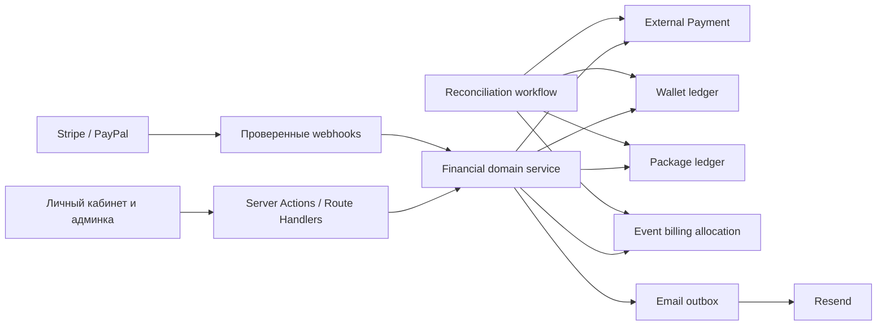
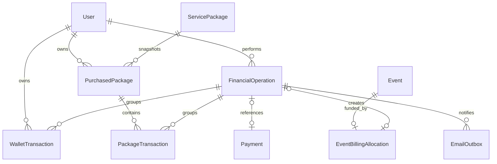

# Архитектура платёжной системы Vershkov

Статус документа: долговременный архитектурный контекст реализованной первой версии.

Дата последней сверки с кодом: 19 июля 2026 года.

Связанный документ с бизнес-сценариями: `docs/payment-system-algorithm.ru.md`.

## 1. Назначение системы

Платёжная система обслуживает два независимых ресурса клиента:

- деньги на внутреннем счёте;
- предоплаченное время в купленных пакетах.

Внешние платёжные провайдеры только вводят и возвращают реальные деньги. Они не должны напрямую определять, появился ли у клиента пакет или была ли оплачена конкретная консультация. Этим занимается внутренний финансовый домен.

Текущая версия использует только EUR. Денежный тариф консультации фиксирован и не зависит от
длительности; пакетный расход равен фактической длительности встречи в целых минутах.

## 2. Карта системы



## 3. Границы ответственности

### 3.1. Платёжный connector

Connector знает только особенности провайдера:

- создание order или payment intent;
- capture;
- проверка webhook-подписи;
- преобразование статусов и сумм;
- загрузка актуального состояния операции;
- стабильные provider IDs.

Connector не должен:

- напрямую менять остаток клиента;
- создавать купленный пакет;
- списывать консультацию;
- отправлять бизнес-письма;
- принимать решение о возврате пакетных минут.

### 3.2. Financial domain service

Единственная точка изменения финансового состояния:

- исполняет пополнение;
- покупает пакет;
- создаёт и компенсирует денежные проводки;
- создаёт и компенсирует пакетные проводки;
- связывает оплату со встречей;
- создаёт outbox-сообщения;
- применяет idempotency и concurrency control;
- возвращает безопасные DTO для UI.

Прямые вызовы Prisma `increment/decrement` для финансовых остатков вне этого сервиса запрещены.

### 3.3. Schedule service

Расписание отвечает за даты, конфликты, статусы и участников. Для консультации оно передаёт financial domain service:

- клиента;
- длительность;
- выбранный источник;
- ID конкретного пакета при пакетном списании;
- actor ID администратора;
- idempotency key запроса.

Создание или изменение оплачиваемой встречи должно быть одной транзакционной бизнес-операцией с allocation и проводкой.

### 3.4. Notification worker

Worker читает `FinancialEmailOutbox`, отправляет письмо, сохраняет provider message ID и выполняет retry. Он не изменяет финансовые остатки.

В коде сущность называется `FinancialEmailOutbox`, а worker запускается маршрутом
`/api/cron/financial-emails`. Отказ Resend не откатывает проводку.

### 3.5. Read model

UI не должен самостоятельно объединять сырые `Payment`, `WalletTransaction` и `PackageTransaction`. Сервер формирует нормализованный DTO финансовой истории.

Пример:

```ts
type FinancialHistoryItemDto = {
  id: string;
  occurredAt: string;
  type: string;
  status: string;
  direction: 'CREDIT' | 'DEBIT' | 'NEUTRAL';
  amount: string | null;
  currency: string | null;
  minutes: number | null;
  balanceAfter: string | null;
  packageRemainingAfter: number | null;
  provider: string | null;
  description: string;
  relatedEvent: { id: string; startsAt: string } | null;
  relatedPackage: { id: string; title: string } | null;
  entries: FinancialHistoryEntryDto[];
};
```

DTO содержит только поля, необходимые интерфейсу. Raw payload провайдера никогда не передаётся в client component.

## 4. Источники правды

| Данные                        | Источник правды                         | Проекция                            |
| ----------------------------- | --------------------------------------- | ----------------------------------- |
| Состояние внешнего платежа    | `Payment` и проверенные provider events | UI-статус платежа                   |
| Денежные движения             | `WalletTransaction`                     | `User.balance`                      |
| Движения пакетных минут       | `PackageTransaction`                    | `PurchasedPackage.remainingMinutes` |
| Способ оплаты встречи         | `EventBillingAllocation`                | Поля истории и UI расписания        |
| Доставка обязательного письма | `EmailOutbox`                           | Индикатор доставки в админке        |
| Технические ошибки            | `SystemLogEntry`                        | Страница системных логов и alerts   |

`SystemLogEntry` не является финансовым источником правды. `PaymentEvent` не заменяет внутренний ledger.

## 5. Основные сущности и связи



## 6. Финансовая операция и проводки

Одна бизнес-операция может содержать несколько проводок.

Примеры:

### Пополнение

```text
FinancialOperation: TOPUP
WalletTransaction: +300 EUR
Payment: Stripe COMPLETED
```

### Покупка пакета с баланса

```text
FinancialOperation: PACKAGE_PURCHASE
WalletTransaction: -300 EUR
PackageTransaction: +600 min
PurchasedPackage: ACTIVE, 600 min
```

### Прямая покупка пакета

```text
FinancialOperation: PACKAGE_PURCHASE
Payment: PayPal COMPLETED
WalletTransaction: +300 EUR
WalletTransaction: -300 EUR
PackageTransaction: +600 min
PurchasedPackage: ACTIVE, 600 min
```

### Встреча из пакета и её отмена

```text
FinancialOperation A: CONSULTATION_CHARGE
PackageTransaction: -60 min
EventBillingAllocation: RESERVED

FinancialOperation B: CONSULTATION_REVERSAL
PackageTransaction: +60 min
EventBillingAllocation: REVERSED
```

## 7. Инварианты

1. Каждая проводка неизменяема.
2. Каждое исправление выполняется новой компенсирующей проводкой.
3. Денежная проводка относится ровно к одному пользователю и всегда использует EUR.
4. Пакетная проводка относится ровно к одному купленному пакету.
5. Остатки пересчитываются из ledger без обращения к провайдеру.
6. Обычная операция не может списать больше доступного остатка.
7. Отрицательный денежный баланс допустим только как последствие внешнего refund, chargeback или явно разрешённой ручной корректировки.
8. Отрицательный пакетный остаток запрещён всегда.
9. Одна встреча имеет максимум один активный источник оплаты.
10. Каталожный пакет не изменяет снимок уже купленного пакета.
11. Повтор одного idempotency key возвращает ранее созданный результат.
12. Финансовая транзакция и создание обязательных outbox-сообщений атомарны.
13. Использованный или купленный каталожный пакет архивируется, а не удаляется физически.
14. Финансово значимые поля оплаченной встречи нельзя менять на месте: текущая первая версия
    требует отмены, автоматической компенсации и создания новой встречи.

## 8. Идемпотентность

Идемпотентность нужна на всех границах:

- создание provider order;
- capture;
- webhook event;
- fulfilment платежа;
- покупка пакета;
- списание встречи;
- отмена встречи;
- ручная корректировка;
- email delivery.

Рекомендуемые ключи:

```text
provider-event:{provider}:{providerEventId}
payment-fulfilment:{paymentId}:{capturedVersion}
package-purchase:{paymentId}:{servicePackageId}
event-charge:{eventId}:{billingRevision}
event-reversal:{eventId}:{billingRevision}
manual-adjustment:{requestId}
financial-email:{operationId}:{template}:{recipient}
```

Уникальный индекс в БД обязателен. Проверка вида «сначала find, затем create» без уникального ограничения недостаточна.

## 9. Конкурентность и транзакции

Для изменения остатков используется `Prisma.TransactionIsolationLevel.Serializable` с ограниченным retry на `P2034`.

Внутри транзакции:

1. Проверяется idempotency key.
2. Читается актуальная проекция остатка.
3. Проверяются бизнес-ограничения.
4. Создаются operation и проводки.
5. Обновляются проекции.
6. Создаются allocation, пакет и outbox при необходимости.
7. Транзакция фиксируется.

Внешний API провайдера и Resend нельзя вызывать внутри долгой DB-транзакции. Сначала выполняется внешний шаг, затем короткий локальный fulfilment. Незавершённый fulfilment восстанавливается webhook или reconciliation workflow.

## 10. Статусы

### 10.1. Внешний платёж

Технический статус провайдера хранится в `Payment.status`. Для UI он нормализуется:

- `PROCESSING`;
- `SUCCESSFUL`;
- `FAILED`;
- `REFUNDED`;
- `REQUIRES_REVIEW`.

Не следует заменять исходный provider status нормализованным значением. Оба нужны для диагностики.

### 10.2. Финансовая операция

- `PENDING`: локальное исполнение ещё не завершено;
- `COMPLETED`: все обязательные проводки созданы;
- `FAILED`: операция не изменила финансовое состояние;
- `REVERSED`: полностью компенсирована;
- `REQUIRES_REVIEW`: финансовое состояние изменено, но требуется решение администратора.

### 10.3. Купленный пакет

- `ACTIVE`;
- `EXHAUSTED`;
- `EXPIRED`;
- `SUSPENDED`;
- `REVOKED`.

`remainingMinutes = 0` обычно означает `EXHAUSTED`, но при отзыве или chargeback пакет может иметь отдельный статус.

### 10.4. Оплата встречи

- `RESERVED`: ресурс списан при постановке встречи в расписание;
- `SETTLED`: встреча завершена;
- `REVERSED`: ресурс возвращён.

## 11. Валюта и суммы

- Единственная валюта системы: EUR.
- Код валюты хранится в верхнем регистре.
- Денежные значения хранятся в `Decimal`, не в `number`.
- На границе provider API выполняется явное преобразование major/minor units.
- Платёж, пакет или refund в другой валюте отклоняется.
- Конвертация валют не поддерживается.

## 12. Пакетные минуты

- Хранятся целыми минутами.
- Длительность встречи вычисляется сервером из `start` и `end`.
- Клиентское поле `duration` не является доверенным источником.
- При расхождении формы и диапазона дат используется диапазон дат.
- Купленный пакет содержит снимок `totalMinutes`.
- Редактирование каталога влияет только на будущие покупки.
- Истечение срока создаёт отдельную пакетную проводку только если бизнесу нужна явная фиксация сгорания. Иначе пакет блокируется статусом, а исторический остаток остаётся видимым как недоступный.

Рекомендуется сохранять неиспользованный остаток при истечении, но исключать его из доступного баланса. Это облегчает аудит и поддержку.

## 13. Тарифы консультаций

Администратор задаёт одну фиксированную стоимость консультации в EUR на странице «Платежи». Настройка хранится в `ConsultationRate` с полями `amount`, `currency = EUR`, `updatedById` и временными метками.

При создании встречи в allocation сохраняется снимок цены. Длительность влияет на пакетные минуты, но не изменяет денежную цену консультации. Пересчёт старых встреч после изменения цены запрещён.

## 14. Письма

Финансовое письмо является побочным эффектом, но обязательным для доставки.

Правила:

- outbox создаётся в той же транзакции, что и проводка;
- отправка асинхронна;
- повторная доставка безопасна;
- payload содержит уже сформированный финансовый снимок, чтобы последующие изменения не меняли содержание письма;
- email клиента и locale фиксируются на момент создания outbox;
- raw provider payload, access token, полные capture IDs и персональные данные сверх необходимого в письмо не попадают;
- администратор видит неуспешные доставки и может повторить отправку.

## 15. Безопасность

Каждый Server Action и Route Handler обязан:

- проверить аутентификацию;
- проверить роль и право на конкретного клиента;
- валидировать input через Zod;
- заново читать цены, валюты, тарифы и принадлежность пакета на сервере;
- не доверять сумме, остатку или минутам из клиента;
- возвращать минимальный DTO;
- не передавать raw provider payload в client components;
- фиксировать actor ID и request/correlation ID.

Webhook обязан проверить подпись до любой записи финансового состояния.

## 16. Логирование

Используются три уровня:

1. `PaymentEvent`: неизменяемые входящие события провайдера.
2. Финансовый ledger: бизнес-история денег и минут без срока автоматического удаления.
3. `SystemLogEntry`: технические запросы, ошибки интеграций, latency и stack traces.

Финансовые суммы и IDs операций можно хранить в ledger. Секреты, токены, полные платёжные реквизиты и избыточные provider payload должны проходить redaction.

## 17. Reconciliation и восстановление

Периодический workflow выполняет read-only проверку и формирует отчёт:

- `User.balance` против суммы wallet ledger;
- `PurchasedPackage.remainingMinutes` против package ledger;
- successful provider payment без завершённого fulfilment;
- локальный успешный payment, который провайдер считает отменённым;
- refund без внутренней отрицательной проводки;
- встреча `SCHEDULED/COMPLETED` без billing allocation;
- allocation без соответствующей проводки;
- обязательный email без outbox или с исчерпанными retry;
- отрицательный баланс;
- зависшие операции.

Автоматическое восстановление разрешено только для идемпотентного fulfilment. Расхождения ledger исправляются компенсирующей операцией после подтверждения администратора.

## 18. Read models и фильтры

Первая версия получает ограниченный сервером read model и фильтрует его в client component.
Безопасные параметры фильтра сохраняются в `localStorage`; поисковая строка с потенциальными
персональными данными не сохраняется. При росте объёма операций read model необходимо перевести на
серверную пагинацию и сериализацию фильтров в URL.

Нормализованная история должна поддерживать:

- фильтрацию по клиенту;
- группе статусов и точному статусу;
- провайдеру;
- типу операции;
- направлению;
- диапазону абсолютной суммы;
- периоду;
- связанному пакету или встрече.

Для денежных и минутных операций применяются отдельные поля. Нельзя сравнивать или суммировать EUR и минуты в одной метрике.

## 19. UI-принципы

- Баланс и пакетные остатки видны до истории операций.
- Зелёный `+` означает увеличение доступного внутреннего ресурса.
- Красный `-` означает уменьшение доступного внутреннего ресурса.
- Статус показывается отдельно от направления.
- Сложная операция группирует проводки, но не скрывает их от пользователя.
- На мобильном таблицы преобразуются в читаемые карточки.
- Недоступный источник оплаты видим и объяснён, а не просто исчезает.
- Перед списанием администратор видит прогноз остатка.
- Отрицательный баланс сопровождается ясным предупреждением и инструкцией.

## 20. Тестовая стратегия

### Unit

- расчёт дельт;
- нормализация статусов;
- расчёт тарифа;
- форматирование знака и цвета;
- выбор доступных пакетов;
- Zod-схема сохранённых фильтров.

### Integration с Prisma

- атомарная покупка пакета;
- одновременное списание последнего остатка;
- повтор webhook/capture;
- refund до и после fulfilment;
- смена источника встречи;
- отмена и повторная отмена;
- пересчёт проекции из ledger;
- outbox создаётся вместе с проводкой.

### Route и Server Action

- auth и RBAC;
- игнорирование клиентской суммы;
- запрет чужого пакета;
- некорректная валюта;
- недостаточный баланс;
- стабильные коды ошибок.

### UI

- покупка пакета с баланса;
- прямая покупка;
- отображение денежных и пакетных остатков;
- signed amounts;
- disabled-состояния формы встречи;
- восстановление фильтров из `localStorage`;
- URL имеет приоритет над `localStorage`;
- mobile layout истории.

### Failure injection

- провайдер ответил timeout после фактического capture;
- webhook пришёл раньше browser callback;
- Resend недоступен;
- serializable conflict;
- workflow повторён после падения процесса;
- provider refund превышает необработанный остаток.

## 21. Миграционная стратегия

### Expand

- добавить новые таблицы и nullable-связи;
- сохранить текущий `User.balance` как EUR-проекцию;
- добавить новые сервисы без переключения reads.

### Backfill

- создать opening balance transaction для каждого ненулевого текущего баланса;
- создать opening balance transaction с отдельным типом `MIGRATION_OPENING_BALANCE`;
- сверить суммы по пользователям;
- сохранить отчёт миграции.

### Dual verification

- временно сравнивать старый и новый остаток;
- все новые операции исполнять через domain service;
- исправить найденные расхождения компенсирующими проводками.

### Contract

- переключить все reads на новые DTO;
- запретить прямое обновление `User.balance`;
- оставить `User.balance` как проекцию и запретить прямые изменения вне domain service.

## 22. Операционные правила

- Не редактировать финансовые записи вручную в Prisma Studio.
- Не удалять успешные payments, операции и проводки.
- Не повторять capture без проверки локального и provider state.
- Для поддержки использовать operation ID и correlation ID.
- Ручная корректировка всегда содержит причину.
- История определяет источник по неизменяемым связям ledger: `MANUAL_ADJUSTMENT` означает
  корректировку администратора, наличие `paymentId` означает платёжный шлюз, отсутствие обоих
  признаков означает внутреннюю операцию. Источник показывается отдельной меткой и не выводится
  из текста описания.
- Возврат использованного пакета всегда требует утверждённой политики.
- Изменение Prisma-схемы поставляется с новой SQL-миграцией.
- Production применяет только `npx prisma migrate deploy`.

## 23. Контекст для будущих улучшений

Архитектура допускает дальнейшее добавление:

- срока действия и продления пакетов;
- промокодов и подарочных сертификатов;
- семейных или групповых пакетов;
- частичной оплаты встречи из нескольких источников;
- налогов, invoices и фискальных документов;
- подписок;
- автоматического выбора пакета по FEFO;
- отчётности по выручке и обязательствам;
- отдельного финансового администратора;
- экспортов для бухгалтерии;
- обмена валют с явным FX ledger.

Любое расширение должно сохранять базовое правило: существующая проводка не изменяется, а новое состояние достигается дополнительной компенсирующей проводкой.

## 24. Карта реализации

- `prisma/schema.prisma` и миграция `20260719090000_add_financial_ledger` — сущности, ограничения
  и opening balance.
- `src/modules/payments/financial/financial-service.server.ts` — единственная точка денежных и
  минутных мутаций.
- `src/modules/payments/financial/financial-history.server.ts` — объединённый безопасный read
  model для админки и личного кабинета.
- `src/modules/payments/financial/financial-email-outbox.server.ts` — claim, retry и доставка
  финансовых писем.
- Stripe и PayPal вызывают financial service после подтверждения capture/refund.
- Route handlers расписания создают событие и allocation в одной serializable-транзакции.
- Административные Server Actions выполняют тариф, provider refund и компенсирующие
  корректировки.
